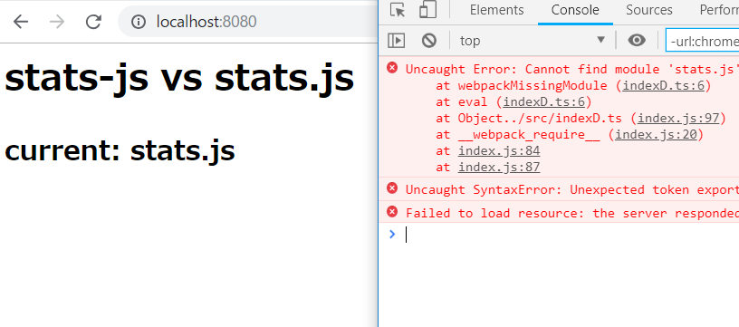
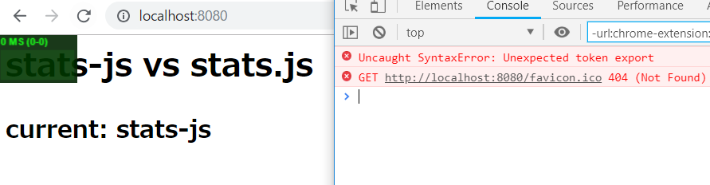

see https://github.com/DefinitelyTyped/DefinitelyTyped/pull/32471

## Usage

```
$ git clone https://github.com/kobatakuJP/statsjstest.git
$ cd statsjstest
$ npm install
```

### stats.js test

```
$ npm run build-d
// display compile error, don't mind.
$ npm run server
// If no change, super reload.(Ctrl + F5)
```

see localhost:8080 from your browser.



### stats-js test

```
$ npm run build-h
// display compile error, don't mind.
$ npm run server
// If no change, super reload.(Ctrl + F5)
```

see localhost:8080 from your browser.


